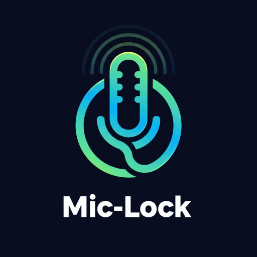

<!-- Badges -->
<div align="center">
  
  
  
</div>

# What is MicLock?

Mic-Lock addresses a frustrating and common issue for **Google Pixel phone** users, especially those who have had their **screens replaced**. During screen replacement procedures, the **bottom microphone** can sometimes become damaged or disconnected, causing apps like WhatsApp, voice recorders, and video calling applications to record silence instead of actual audio.

This app was specifically **invented to fix this issue** by running discreetly in the background and **automatically rerouting all audio recording** from other apps to a **working microphone** (typically the **earpiece microphone**). The solution is **battery-efficient** because it uses minimal processing power to maintain the correct audio path without storing or analyzing any audio data, and intelligently steps aside when other apps need to record.

## 🔧 Installation

### Option 1: Google Play (Closed Alpha)
Join the **closed testing program** on Google Play to download and receive updates automatically:
- Send me your email to `dan8oren@gmail.com` and request to join the testing 🙏 
this will help deploying MicLock in Google Play Store for everyone!
- after that you can download the app from here:
<a href="https://play.google.com/store/apps/details?id=io.github.miclock" target="_blank">
  
</a>

> 🔗 [Join on the web](https://play.google.com/apps/testing/io.github.miclock)

---

### Option 2: Download APK
1. Download the latest stable APK from the [**Releases**](https://github.com/Dan8Oren/MicLock/releases/) page.
2. Enable *“Install from Unknown Sources”* in your device settings if prompted (standard for sideloaded apps).
3. Install the downloaded APK file.
4. Grant **microphone** and **notification** permissions when the app first launches.

---

### Option 3: Build from Source (For developers and advanced users)

```bash
git clone https://github.com/Dan8Oren/MicLock.git
cd MicLock
./gradlew assembleRelease
```

## 🎯 Quick Start

1.  **Launch the app** and complete the initial permission requests.
2.  **Tap "Start"** to activate microphone protection.
3.  **Test with WhatsApp** or another app by recording a voice message or making a call.
4.  **Enjoy working audio!** The app runs silently in the background, continuously safeguarding your microphone access.

## 📱 How It Works

Mic-Lock acts as a "polite background holder" that:
1.  **Detects Faulty Microphone**: Identifies when the default microphone path is compromised (typically the bottom mic on Pixel devices).
2.  **Secures Working Mic**: Establishes and holds a connection to your device's *working* earpiece microphone array in a battery-efficient manner.
3.  **Intelligent Screen Management**: Uses configurable delays (default 1.3 seconds) before re-activating when screen turns on, preventing unnecessary battery drain during brief interactions like checking notifications.
4.  **Graceful Handover**: When other apps start recording, Mic-Lock gracefully releases its hold.
5.  **Correct Path Inheritance**: The other app then inherits the correctly routed audio path to the functional microphone instead of defaulting to the broken one.
6.  **Seamless Experience**: Your recordings and calls work perfectly without manual intervention!

## 🔒 Security & Privacy

Mic-Lock is built with user privacy and security as core principles:

- The app does **not collect, store, or transmit any personal data**.
- All audio management happens **locally on your device**.
- Only **essential permissions** (microphone and notifications) are requested.
- **No network access** is required; Mic-Lock works entirely offline.
- The entire codebase is **open source** and available for review.

For full details, please see:
- [Security Policy](https://github.com/Dan8Oren/MicLock/blob/main/SECURITY.md)
- [Privacy Policy](https://github.com/Dan8Oren/MicLock/blob/main/PRIVACY.md)

If you have questions or wish to report a vulnerability, consult the guides above or open an issue in the repository.

## ✨ Quick Settings Tile
<div align="center">
<br>
  
</div>
<br>
For even easier access, Mic-Lock includes a Quick Settings tile.

1.  **Add the Tile**: Pull down your notification shade, enter edit mode, and drag the "MicLock" tile to your active tiles.
2.  **One-Tap Control**:
    - **Tap to Start/Stop**: Instantly activate or deactivate microphone protection.
    - **See Status**: The tile's icon changes to show you if the service is **On** (active), **Off** (inactive), or **Paused** (another app is using the mic).


## ⚙️ Settings

-   **AudioRecord Mode**: (Default) More battery-efficient, optimized for most modern devices. If you experience high battery usage, switch to this mode.
-   **MediaRecorder Mode**:  Offers wider compatibility, especially on older or more problematic devices, but might use slightly more battery.
-   **Screen-On Delay**: Configurable delay (0-5000ms, default 1.3 seconds) before re-activating microphone when screen turns on. This prevents unnecessary battery drain during brief screen interactions like checking notifications or battery level. Set to 0 for immediate activation.

## 🛠️ Troubleshooting

**Q: The app doesn't seem to work, or audio is still silent.**
A: The most common fix is to switch between **MediaRecorder Mode** and **AudioRecord Mode** in the app's settings.

For more detailed solutions, device-specific fixes, and advanced diagnostics, please see the full **[Troubleshooting Guide](docs/troubleshooting.md)**.

## 🤝 Contributing

We welcome all contributions from the community! Your help is valuable, whether you're a developer or a user providing feedback.
### How You Can Help
Here are a few ways you can contribute to making MicLock better for everyone:

-   **Report a Bug**: If you find something that isn't working correctly, please [submit a bug report](https://github.com/Dan8Oren/MicLock/issues/new?template=bug_report.md).
-   **Share Device Feedback**: Does MicLock work on your phone? Help us build a compatibility list by [submitting a device report](https://github.com/Dan8Oren/MicLock/issues/new?template=device_compatibility.md).
-   **Suggest a Feature**: Have a great idea for a new feature? We'd love to hear it! [Suggest a new feature](https://github.com/Dan8Oren/MicLock/issues/new?template=feature_request.md).
-   **Improve Documentation**: If you find a typo or think a section in our documentation could be clearer, feel free to open an issue or submit a pull request.

For code contributions and more detailed guidelines, please see our [CONTRIBUTING.md](CONTRIBUTING.md).

## 📄 License

This project is licensed under the MIT License - see the [LICENSE](LICENSE) file for full details.

## 📖 Technical Details

For developers and those interested in the technical implementation, architecture, problem-solving approach, and detailed behavioral specifications, refer to the [DEV_SPECS.md](DEV_SPECS.md) file. This document provides deep insights into the app's internal logic and design decisions.

---

**Supported Android Versions**: Android 7.0 (API 24) and above
**Tested Devices**:
 - **Google Pixel 7 Pro** (primary development and testing device).
 - **Google Pixel 7**
 - **Google Pixel 8**

 Compatibility with other devices is expected but may require adjustments or specific mode selections (AudioRecord/MediaRecorder).
