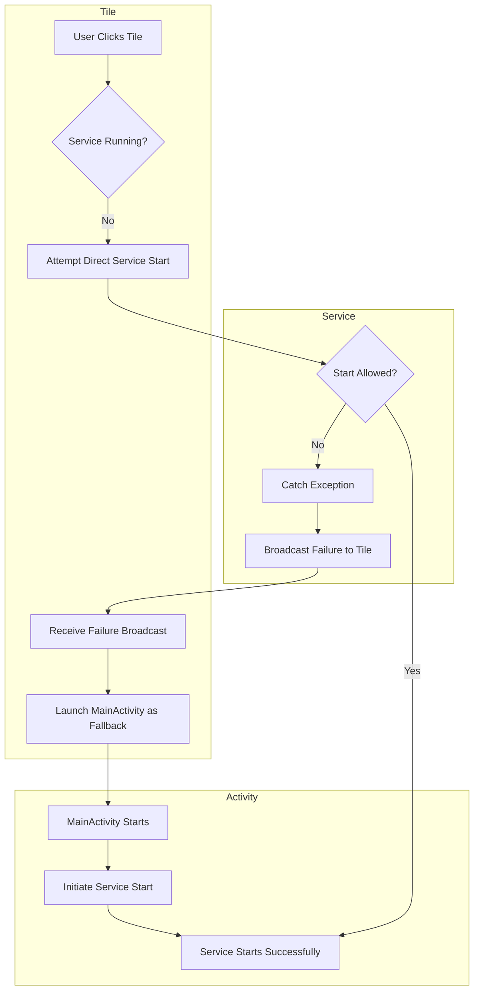
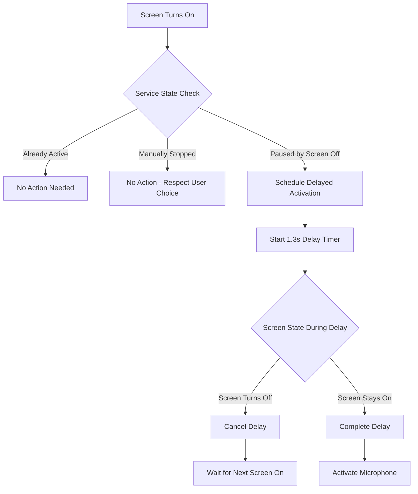

# Mic-Lock Architecture Overview

This document provides a high-level overview of Mic-Lock's architecture and how it achieves its goal of rerouting microphone input. For detailed technical specifications, please refer to [DEV_SPECS.md](../DEV_SPECS.md).

## 🎯 Core Problem

Certain Android devices, notably **Google Pixel phones after screen replacements**, can develop an issue where the primary (bottom) microphone becomes faulty. While other microphones (like the earpiece microphone) remain functional, applications often default to the broken primary microphone, leading to silent recordings.

## 🔧 Solution Approach

Mic-Lock employs a **background service** that continuously monitors and manages microphone access. Its primary strategy is to acquire and "hold" a connection to a known-good microphone (typically the earpiece or an alternative functional mic). When another application requests microphone access, Mic-Lock gracefully releases its hold, allowing the system to hand over the *correctly routed* functional microphone to the requesting app.

## 🏗️ Architecture Components

### 1. MicLockService (Core Service)

The heart of the application - a `ForegroundService` that runs continuously to manage microphone access.

**Key Responsibilities:**
- **Persistent Notification**: Displays a persistent notification to indicate active status and reduce the likelihood of system termination
- **Microphone Acquisition**: Utilizes Android's audio APIs (`MediaRecorder` or `AudioRecord`) to acquire and hold a functional microphone
- **Dual Mode Support**: Supports two distinct modes (`MediaRecorder Mode` and `AudioRecord Mode`) for compatibility across different devices and Android versions
- **Intelligent Screen State Management**: Integrates with DelayedActivationManager for battery-efficient screen-on behavior
- **Polite Yielding**: Gracefully releases microphone when other apps need it
- **Route Validation**: Validates that the acquired microphone route is functional

**Service Lifecycle:**
```
User Start → Foreground Service → Microphone Acquisition → 
Background Holding → Yield to Apps → Re-acquisition → Repeat
```

### 2. AudioSelector (Route Management)

A utility class responsible for identifying and selecting suitable working microphones.

**Key Functions:**
- **Device Enumeration**: Probes available audio input devices
- **Route Validation**: Determines which microphones are functional vs. faulty
- **Quality Assessment**: Evaluates microphone routes based on technical criteria
- **Fallback Logic**: Provides alternative routes when primary choices fail

**Route Selection Criteria:**
- Multi-channel capability (stereo preferred)
- Primary array positioning (Y-coordinate >= 0)
- Device address validation (avoiding `@:bottom`)
- Channel count verification

### 3. MainActivity (User Interface)

Provides the user interface for controlling the service and configuring settings.

**UI Components:**
- **Service Controls**: Start/Stop buttons for the background service
- **Status Display**: Real-time status updates (ON/PAUSED/OFF)
- **Mode Selection**: Toggle between MediaRecorder and AudioRecord modes
- **Battery Information**: Guidance on battery optimization settings

### 4. Prefs (Settings Management)

Handles persistent storage of user settings and preferences.

**Stored Settings:**
- Recording mode preference (MediaRecorder/AudioRecord)
- Last successful recording method
- Auto-restart preferences
- User configuration choices

### 5. DelayedActivationManager (Delay Management)

A specialized component responsible for managing configurable delays before microphone re-activation when the screen turns on.

**Key Responsibilities:**
- **Delay Scheduling**: Manages coroutine-based delays with proper cancellation and cleanup
- **Race Condition Handling**: Handles rapid screen state changes with latest-event-wins strategy
- **State Validation**: Ensures delays respect existing service states (manual stops, active sessions, paused states)
- **Battery Optimization**: Prevents unnecessary microphone operations during brief screen interactions

### 6. MicLockTileService (Quick Settings Tile)
A `TileService` that acts as a primary remote control for the `MicLockService`.

**Key Responsibilities:**
- **State-Aware UI**: Reflects the real-time status of the service (Active, Inactive, Paused, Activating, No Permission).
- **One-Tap Control**: Allows the user to start and stop the service directly from the Quick Settings panel.
- **Delay State Display**: Shows "Activating..." state during delay periods with manual override capability.
- **Resilient Start Logic**: Implements a robust fallback mechanism to ensure service activation even when the app is in the background, by launching the main activity if a direct start fails.


## 🔄 Data Flow

### Tile-Initiated Start-up Flow

To ensure reliability on modern Android versions, the Quick Settings tile uses a multi-layered fallback system to handle foreground service start restrictions.



### Simplified Operation Flow

1. **Service Initialization**
   - User starts `MicLockService` from `MainActivity`
   - Service enters foreground mode with persistent notification
   - Battery optimization checks and wake lock management

2. **Microphone Route Establishment**
   - `AudioSelector` evaluates available microphone devices
   - Service attempts acquisition using preferred mode (MediaRecorder/AudioRecord)
   - Route validation confirms quality of established connection
   - Fallback to alternative mode if route quality is poor

3. **Background Holding Phase**
   - Service maintains connection to functional microphone
   - Minimal battery usage through efficient holding strategy
   - Continuous monitoring for other app microphone requests

4. **Polite Yielding Process**
   - Detection of other app microphone requests via `AudioRecordingCallback`
   - Immediate release of microphone hold
   - Other app inherits the correctly routed microphone path
   - Service enters "paused" state, waiting for opportunity to re-acquire

5. **Re-acquisition Cycle**
   - Exponential backoff strategy to avoid conflicts
   - Monitoring for completion of other app's microphone usage
   - Graceful re-establishment of microphone hold

## 🔋 Battery Efficiency Strategy

### AudioRecord Mode (Preferred)
- Lightweight audio sampling without full recording
- Minimal CPU and memory usage
- Optimized for continuous background operation

### MediaRecorder Mode (Compatibility)
- Full MediaRecorder instantiation for better route establishment
- Higher resource usage but superior device compatibility
- Recommended for problematic devices or when AudioRecord fails

### Power Management
- **Wake Lock Management**: Minimal CPU wake locks only during active recording
- **Screen State Integration**: To maximize reliability, the service remains in the foreground even when the screen is off. When the screen turns off, microphone usage is paused to conserve battery, and the notification is updated to "Paused (Screen off)". This prevents the OS from killing the service.
- **Intelligent Delay System**: Configurable delays (default 1.3 seconds) before re-activating microphone when screen turns on, preventing unnecessary operations during brief screen interactions
- **Foreground Service**: Prevents system termination while maintaining low priority

### Delayed Activation Flow

When the screen turns on, Mic-Lock employs an intelligent delay system to optimize battery usage:



This system prevents unnecessary microphone activation during brief screen interactions like checking notifications or battery level, while ensuring responsive behavior for legitimate usage.

## 🛡️ Android Compatibility

### Android 14+ Adaptations
- **Background Service Restrictions**: Graceful handling of `ForegroundServiceStartNotAllowedException`
- **Boot vs User Start**: Different strategies for system-initiated vs user-initiated starts
- **Screen State Coordination**: Proper coordination with screen state changes

### Version Support
- **Minimum API**: Android 7.0 (API 24)
- **Target API**: Latest Android version
- **Progressive Enhancement**: Advanced features on newer Android versions

## 🔍 Technical Implementation Details

### Dual Recording Strategy

```kotlin
// Simplified strategy logic
if (userPreference == MediaRecorder) {
    success = tryMediaRecorderMode()
    if (!success) fallbackToAudioRecord()
} else {
    result = tryAudioRecordMode()
    if (result == BAD_ROUTE) fallbackToMediaRecorder()
}
```

### Route Validation Logic

```kotlin
// Core validation criteria
val isBadRoute = !routeInfo.isOnPrimaryArray || 
                (requestedStereo && actualChannels < 2) ||
                routeInfo.deviceAddress == "@:bottom"
```

### Polite Yielding Implementation

```kotlin
// Callback-based silencing detection
override fun onRecordingConfigChanged(configs: List<AudioRecordingConfiguration>) {
    val silenced = myConfig.isClientSilenced
    if (silenced && !wasSilenced) {
        gracefullyReleaseAndWait()
    }
}
```

## 🧪 Testing Strategy

### Validation Methods
1. **Baseline Test**: Verify good route establishment (`dumpsys audio`)
2. **Integration Test**: Confirm route inheritance by other apps
3. **Quality Test**: Validate actual audio capture (not silence)
4. **Battery Test**: Monitor power consumption across modes

### Success Criteria
- Other recording apps capture clear audio instead of silence
- Consistent establishment of primary array routes (not bottom mic)
- Graceful yielding to foreground applications
- Reasonable battery usage, especially in AudioRecord mode

## 🔮 Future Considerations

### Potential Enhancements
- **Machine Learning**: Automatic mode selection based on device characteristics
- **Extended Device Support**: Broader compatibility beyond Pixel devices
- **Advanced Route Detection**: More sophisticated microphone quality assessment
- **User Analytics**: Optional usage analytics for improving compatibility

### Architectural Flexibility
The modular design allows for:
- Easy addition of new recording strategies
- Extended route validation criteria
- Platform-specific optimizations
- Enhanced user interface features

## 📚 Related Documentation

- **[DEV_SPECS.md](../DEV_SPECS.md)**: Detailed technical specifications and behavioral requirements
- **[Setup Guide](setup.md)**: User installation and configuration instructions
- **[Troubleshooting](troubleshooting.md)**: Common issues and solutions
- **[Contributing Guide](../CONTRIBUTING.md)**: Development setup and contribution guidelines

This architecture ensures Mic-Lock continues to solve the core problem of enabling reliable microphone access for other applications on devices with faulty microphone hardware, while maintaining efficiency and compatibility across the Android ecosystem.